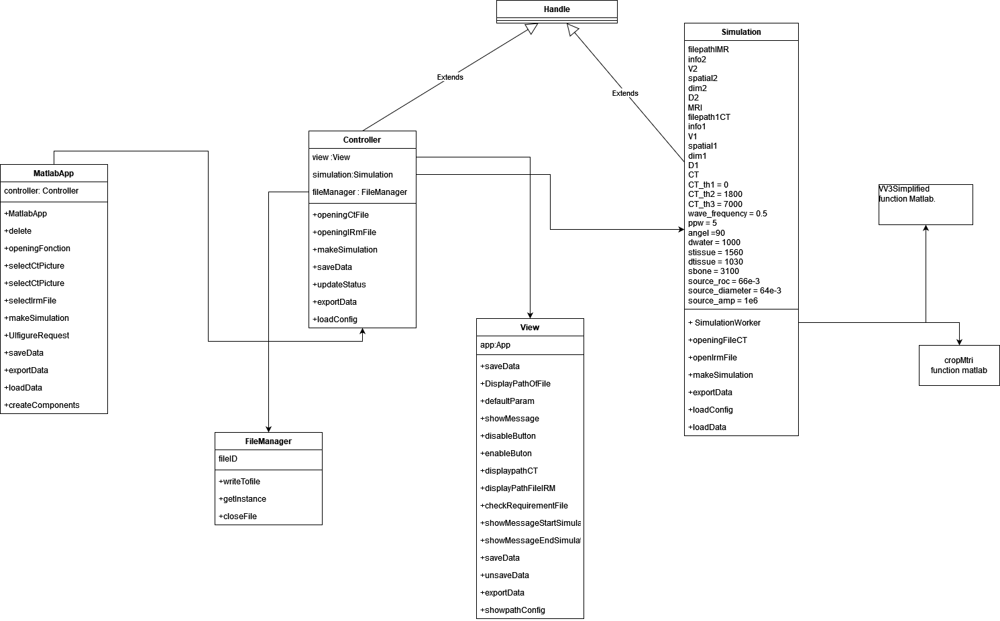

# Erasmus Project 
## Composition depot
### Directory of source code from Dapeng
- The transcranial ultrasonic sound field simulation program.
- Pictures CT(Computed Tomography).
- Pictures MRI(Magnetic Resonance Imaging)
### Directory of source code from application 
- Application program source code to make the script more modular.
### Utils function
- Function needed to run project.
- VV3Simplified : function to obtain a target (x,y,z) and navigate in a plane
- cropMtri: matrix cropping function, with saggital, frontal and transverse planes depending on target
- DapengSourcecode_update: source code updated with modification done in princiapl project
- foundTransductor : function to find transductor with angle

## Fonctionnality
Development of an application to manipulate medical imaging data for ultrasonic simulation in a heterogeneous environment.
## Technologies used
- MATLAB.
- MATLAB app designer.
- Kwave Toolbox (toolbox matlab for simulation).
## Diagram UML
Brief program architecture.

## Rapport de stage
- pdf du rapport de stage.
## Author
**Thomas Geller.**